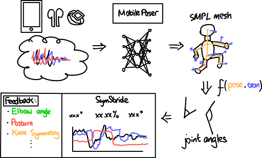
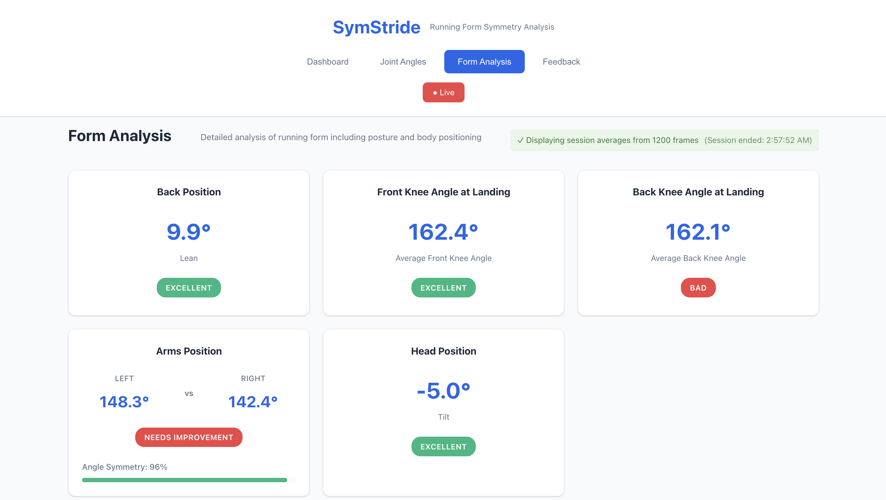
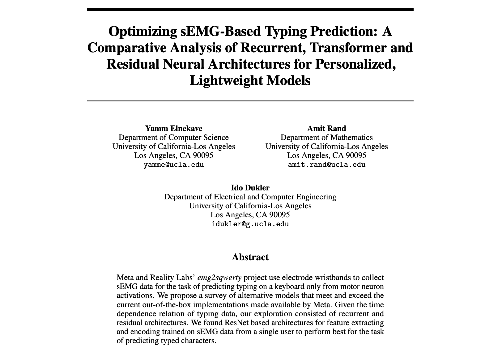
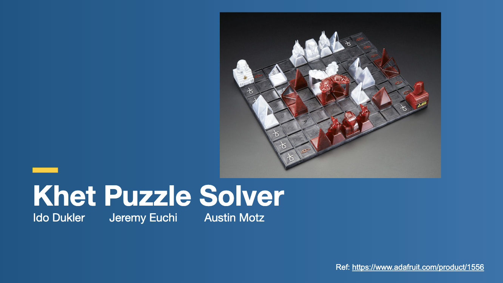
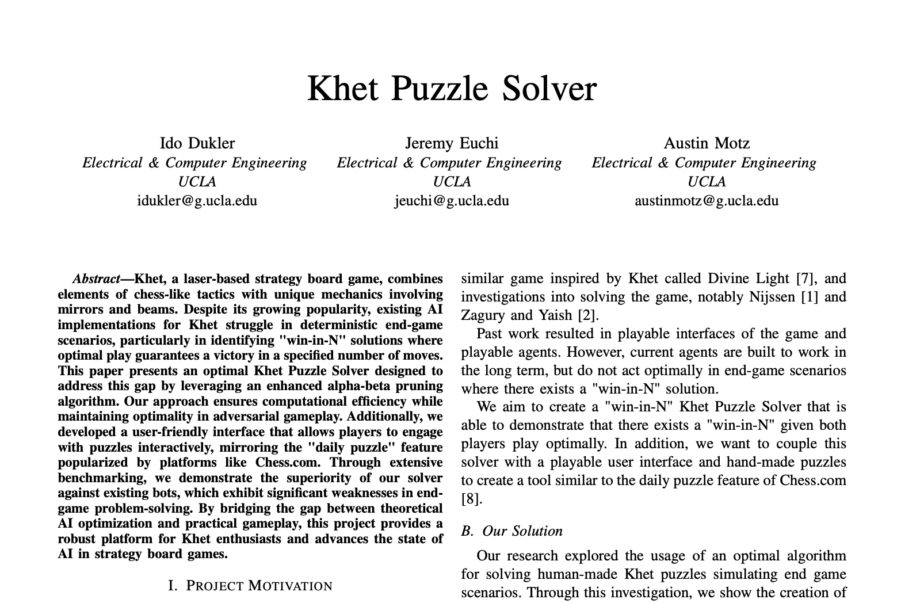
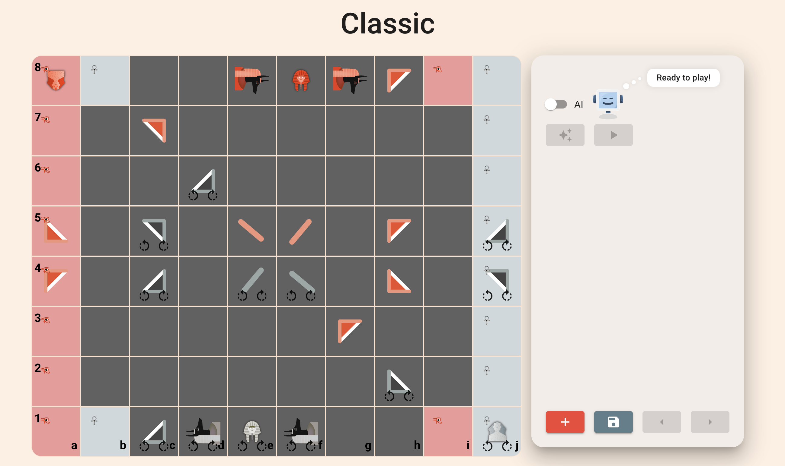
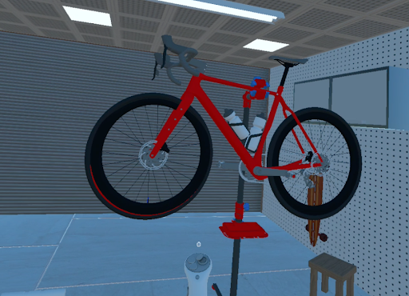
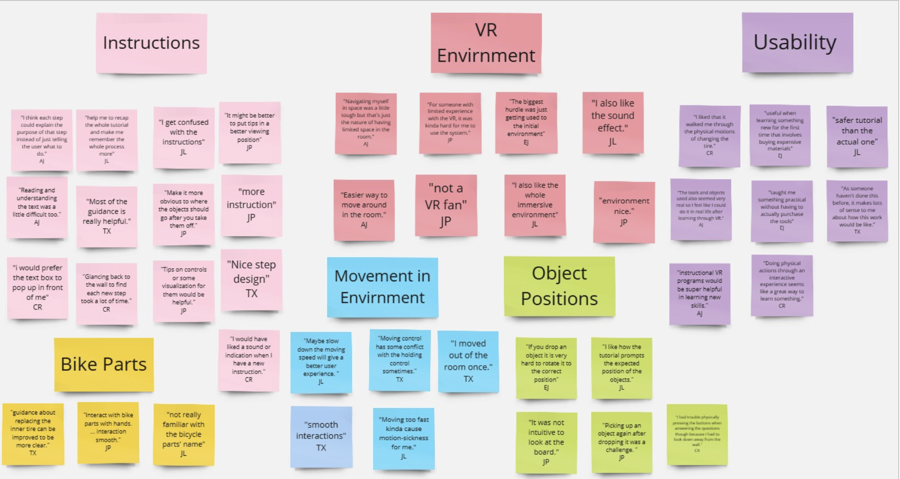

## Hi there, my name is Ido! 👋
I'm a master’s student studying Computer Engineering at UCLA's Samueli School of Engineering with a focus on Signals & Systems. I bring two years of internship experience from my time at [SeeByte](https://www.seebyte.com/) spanning ML, DevOps, and full-stack projects. I am actively seeking roles in ML and agentic systems, embedded systems, and edge AI. 

## Projects

### SymStride
An AI running coach that lives in your pocket. 

**Tech Stack**: Frontend: Typescript, React. Backend: Python, Flask. Devices: iPhone & Apple Watch IMUs sending data using the SensorLogger app over HTTP.

<table style="display:table; width:auto; margin:0 auto;">
  <tr>
    <td align="center">
      

        

          <a href="https://yibochen18.github.io/ECM_2025Fall_Project_16/final_report.html" target="_blank" rel="noopener noreferrer"><strong>SymStride Website</strong></a>
        

        <a href="https://yibochen18.github.io/ECM_2025Fall_Project_16/final_report.html" target="_blank" rel="noopener noreferrer" style="text-decoration:none; border:0;">
          <table border="0" cellpadding="8" cellspacing="0" bgcolor="#ffffff">
            <tr>
              <td>
                
              </td>
            </tr>
          </table>
        </a>
      

    </td>
    <td align="center">
      

        

          <a href="https://youtu.be/ps6nEUCEM1I" target="_blank" rel="noopener noreferrer"><strong>Demo</strong></a>
        

        
      

    </td>
  </tr>
</table>

### sEMG Activations to Keyboard Typing
Building on Meta's emg2qwerty dataset and model architecture to train a model for predicting keyboard typing from sEMG motor activations from your wrists.

**Tech Stack**: GCP (compute), PytTorch, Numpy, Matplotlib, TensorBoard

<table style="display:table; width:auto; margin:0 auto;">
  <tr>
    <td align="center">
      

        

           <a href="emg2qwerty/report.pdf" target="_blank" rel="noopener noreferrer"><strong>Manuscript</strong></a>
        

        
      

    </td>
  </tr>
</table>

### Khet Puzzle Solver
A state definition, web application, and AI algorithm for solving the <a href="https://en.wikipedia.org/wiki/Khet_(game)" target="_blank" rel="noopener noreferrer">Khet</a> (laser chess) puzzle.

**Tech Stack**: Frontend: React, JavaScript. Backend: Python, Flask

<table style="display:table; width:auto; margin:0 auto;">
  <tr>
    <td align="center">
      

        

          <a href="https://www.youtube.com/watch?v=es5wQxvOql8" target="_blank" rel="noopener noreferrer"><strong>Background Presentation</strong></a>
        

        
      

    </td>
    <td align="center">
      

        

          <a href="Khet/report.pdf" target="_blank" rel="noopener noreferrer"><strong>Manuscript</strong></a>
        

        
      

    </td>
    <td align="center">
      

        

          <a href="https://khet.netlify.app/" target="_blank" rel="noopener noreferrer"><strong>End-to-End Project</strong></a>
        

        
      

    </td>
  </tr>
</table>

### BikeWorkshop
A virtual reality game for learning to fix your bike's flat tires.

**Tech Stack**: Software: Unity, Swift, Meta Quest Hub. Devices: Oculus Quest 2

<table style="display:table; width:auto; margin:0 auto;">
  <tr>
    <td align="center">
      

        

          <a href="https://youtu.be/s5a_6CmKzjs" target="_blank" rel="noopener noreferrer"><strong>Demo</strong></a>
        

        
      

    </td>
     <td align="center">
      

        

          <a href="BikeWorkshop/presentation.pdf" target="_blank" rel="noopener noreferrer"><strong>Background Presentation</strong></a>
        

        
      

    </td>
  </tr>
</table>

